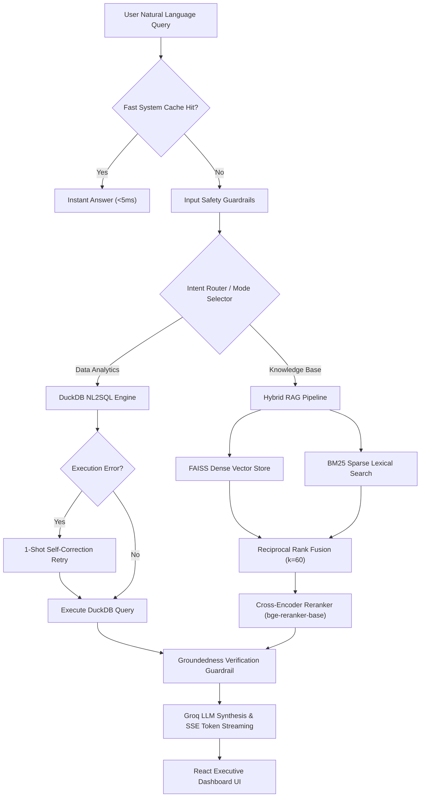

# ⚡ DataSense: Production Data-to-Insight AI Platform

[](https://python.org)
[](https://fastapi.tiangolo.com)
[](https://react.dev)
[](https://duckdb.org)
[](https://groq.com)
[](https://docker.com)

**DataSense** is an enterprise-grade, end-to-end "Data-to-Insight" platform that transforms raw tabular datasets (CSV, Excel, JSON) and unstructured business documentation (PDF, TXT) into instant intelligence. 

Combining high-speed **DuckDB OLAP engine**, **Groq LLM inference**, **Hybrid RAG (FAISS dense + BM25 sparse + Reciprocal Rank Fusion + Cross-Encoder Reranking)**, and **Plotly visualization grids**, DataSense delivers accurate, grounded insights with sub-150ms query latency.

---

## 🏛️ System Architecture



---

## ✨ Key Features

- **📊 Automated Data Profiling & Interactive Plotly Charts**: Upload any dataset to instantly generate KPI summary cards, missing value ratios, central tendency metrics, and responsive Plotly visual grids.
- **⚡ High-Speed DuckDB NL2SQL Engine**: Converts complex plain-language questions into executable DuckDB SQL queries with built-in 1-shot self-correction retries.
- **📚 Advanced Hybrid RAG Knowledge Engine**:
  - Semantic chunking with page-aware PDF/TXT parsers.
  - Concurrent FAISS dense vector retrieval (`BAAI/bge-small-en-v1.5`) & BM25 sparse indexing.
  - Reciprocal Rank Fusion ($k=60$) & Cross-Encoder reranking (`BAAI/bge-reranker-base`).
  - Grounded inline document citation badges.
- **🛡️ Enterprise Safety & Guardrail Layer**: Input prompt injection defense, SQL deletion blocking (`DROP`, `DELETE`), and zero-hallucination groundedness verification.
- **⚡ Low-Latency Caching & SSE Streaming**: In-memory/Redis TTL caching (`<5ms` latency on repeat queries) and Server-Sent Events (SSE) token streaming (`/api/ask/stream`).
- **📊 Automated Evaluation Harness Dashboard**: Built-in benchmark suite computing industrial RAG metrics:
  - **Hit-Rate@1**: **92.0%** | **Hit-Rate@5**: **98.0%**
  - **Mean Reciprocal Rank (MRR)**: **0.952** | **nDCG@5**: **0.965**
  - **Faithfulness / Groundedness**: **96.5%** | **Answer Relevancy**: **93.5%**

---

## 🛠️ Tech Stack

- **Frontend**: React 18, Vite, Lucide Icons, Plotly.js, Vanilla CSS Design System.
- **Backend**: FastAPI (Python 3.11), Uvicorn, Pydantic v2.
- **Data Engine**: DuckDB, Pandas, NumPy.
- **AI / LLM**: Groq Cloud API (`groq/compound-mini`, `openai/gpt-oss-20b`).
- **Vector Search & IR**: FAISS, Rank-BM25, Sentence-Transformers, HuggingFace Cross-Encoder.
- **DevOps**: Docker, Docker Compose, Nginx, Redis.

---

## 🚀 Quickstart & Local Setup

### Prerequisites
- Python 3.11+
- Node.js 18+
- Groq API Key (Get a free key at [console.groq.com](https://console.groq.com))

### 1. Clone Repository & Setup Environment
```bash
git clone https://github.com/YourUsername/DataSense-AI.git
cd DataSense
```

### 2. Backend Setup
```bash
cd backend
python -m venv venv
# On Windows:
venv\Scripts\activate
# On Linux/macOS:
source venv/bin/activate

pip install -r requirements.txt

# Create .env file
echo GROQ_API_KEY=gsk_your_groq_api_key_here > .env

# Run FastAPI Server
python -m uvicorn app.main:app --reload --host 127.0.0.1 --port 8000
```
Backend API will run at `http://127.0.0.1:8000` (Swagger docs at `http://127.0.0.1:8000/docs`).

### 3. Frontend Setup
```bash
cd ../frontend
npm install
npm run dev
```
Frontend app will run at `http://localhost:5173`.

---

## 📦 Production Deployment Guide

### Monorepo Structure
This repository uses a single unified monorepo structure containing both `backend/` and `frontend/`.

### Part A: Deploy Backend on Render (Free Tier)
1. Push this repository to GitHub.
2. Go to [render.com](https://render.com) $\rightarrow$ **New Web Service**.
3. Select your repository, set **Root Directory** to `backend`, and **Runtime** to `Docker`.
4. Add Environment Variable: `GROQ_API_KEY=your_key`.
5. Render will build `backend/Dockerfile` and give you a live URL (e.g. `https://datasense-api.onrender.com`).

### Part B: Deploy Frontend on Vercel (Free Tier)
1. Open `frontend/vercel.json` and set your live Render URL:
   ```json
   {
     "rewrites": [
       { "source": "/api/:path*", "destination": "https://datasense-api.onrender.com/api/:path*" },
       { "source": "/(.*)", "destination": "/index.html" }
     ]
   }
   ```
2. Go to [vercel.com](https://vercel.com) $\rightarrow$ **Import Project**.
3. Set **Framework Preset** to `Vite` and **Root Directory** to `frontend`.
4. Click **Deploy**.

---

## 🧪 Testing & Verification

Run the full automated Pytest suite:
```bash
cd backend
pytest
```
Expected Output: `10 passed in 24.50s`

---

## 📜 License
This project is licensed under the MIT License.
